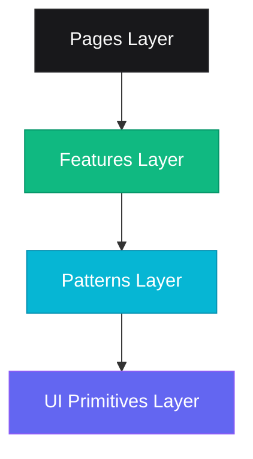

# ShowLi 🎬 — Your Ultimate Movie & TV Planner

<p align="center">
  
</p>

<h3 align="center">ShowLi</h3>

<p align="center">
  A premium, high-fidelity, and feature-rich movie planner and community discussion platform. ShowLi allows users to discover trending media, manage highly customizable collections, engage in real-time community discussions, and customize their cinematic profiles.
</p>

<p align="center">
  <a href="https://react.dev/"></a>
  <a href="https://vite.dev/"></a>
  <a href="https://tailwindcss.com/"></a>
  <a href="https://typescriptlang.org/"></a>
  <a href="https://firebase.google.com/"></a>
  <a href="https://redux-toolkit.js.org/"></a>
</p>

<p align="center">
  <a href="https://showli.netlify.app/"></a>
  <a href="https://github.com/anfiquehussain/showli"></a>
</p>

---

## 📌 Table of Contents

* [🌟 Key Features](#-key-features)
* [🏗️ Core Architecture (Strict 3-Layer UI)](#️-core-architecture-strict-3-layer-ui)
* [📐 Strict Coding Standards & Golden Rules](#-strict-coding-standards--golden-rules)
* [🛠️ Technology Stack](#️-technology-stack)
* [📁 Codebase Directory Structure](#-codebase-directory-structure)
* [🚀 Getting Started](#-getting-started)
* [🧪 Available Scripts](#-available-scripts)
* [🤝 Contribution Guidelines](#-contribution-guidelines)
* [📝 License & Attributions](#-license--attributions)

---

## 🌟 Key Features

### 🔍 Advanced Discovery & Intelligent Filters
- **Smart Browse & Search**: Instantly browse thousands of movies and TV shows using a fast, keyboard-accessible universal search.
- **Granular Multi-Filters**: Filter titles dynamically by specific genres, release year ranges, TMDb ratings, sort criteria, and specific production countries.
- **Dynamic URL Parameters**: Active search states and filters are fully synchronized with the browser URL parameters, making results perfectly shareable and bookmarkable.

### 💬 Real-Time "ShowLi" Discussions & TMDb Reviews
- **Polymorphic Media Mapping**: Discussion sections are integrated across all TMDb entities (Movies & TV Shows).
- **Session-Based Discussions**: Built using Firestore `onSnapshot` queries, supporting live, real-time message updates for an active community feel.
- **Threaded Comment Structure**: Supports sub-comment replies with full nested comment tree rendering.
- **Dual-Sentiment System**: Combines official TMDb community critics reviews with custom ShowLi user ratings (only top-level comments can carry ratings to avoid spam).

### 🗂️ Custom Collections & Smart Library Dashboard
- **Advanced Media Planner**: Organize movies and TV shows into custom playlists/collections (e.g., "Must Watch", "Sci-Fi Favorites", "Family Night").
- **Custom Color Palettes**: Assign curated, premium color cards to your collections for easy categorization.
- **In-Collection Search & Filter**: Easily filter, sort, and query media inside large collections.
- **Multi-Format Export**: Export collections seamlessly into structured `JSON`, comma-separated `CSV`, or customizable formatted `Plain Text` with options to copy to clipboard or download directly.
- **Interactive Random Picker**: Indecisive about what to watch? Use the collection randomizer tool to pick a high-rated movie from your library.

### 👤 Interactive Profiles & Favorites
- **Dynamic Profile Hero**: Edit cover profiles, custom bio updates, and visual highlights.
- **Favorites Integration**: Quickly pin your absolute favorite films and series to display on your profile page.
- **Activity & Reviews Log**: Browse all of your past review entries and ratings under a clean, unified dashboard.

---

## 🏗️ Core Architecture (Strict 3-Layer UI)

ShowLi enforces a highly structured, scalable **3-Layer UI Architecture** to guarantee absolute separation of concerns, high reusability, and strong decoupling.



### 1. `components/ui/` — Primitives (Atomic & Reusable)
- **Role**: Lowest-level, visual UI building blocks.
- **Rules**: Absolutely "dumb" components with zero business rules, domain entities, side effects, or API requests. They are styled strictly for hover, focus, disabled states, and visual accessibility.
- **Examples**: `Button`, `IconButton`, `Input`, `Badge`, `Skeleton`, `Rating`.

### 2. `components/patterns/` — Compositions (Domain-Agnostic)
- **Role**: Reusable compositions of primitives that solve visual problems but remain domain-agnostic.
- **Rules**: Zero references to domain-specific terminology (like "Movie", "Show", or "User"). They communicate entirely through abstract props.
- **Examples**: `Modal`, `ConfirmationModal`, `PageHeader`, `SearchBar`, `MediaScroll`, `StatCard`, `ScrollContainer`.

### 3. `components/features/` — Business Context (Domain-Specific)
- **Role**: Business-specific units containing state, custom hooks, utilities, and API connections.
- **Rules**: Organised cleanly by feature domains (e.g., `media/`, `collections/`, `auth/`). May call APIs and reference domain models (like `TmdbMovie` or `Collection`).
- **Examples**: `MediaHero`, `ShowliDiscussion`, `BrowseFilters`, `CollectionDetailsHeader`, `ExportModal`.

---

## 📐 Strict Coding Standards & Golden Rules

Before you edit or contribute, make sure to strictly follow the guidelines defined in [project/rules.md](project/rules.md) and [project/files.md](project/files.md):

### 🔄 1. Strict Import Direction
Imports **MUST** flow in one direction only:
$$\text{UI Primitives} \longrightarrow \text{Reusable Patterns} \longrightarrow \text{Business Features} \longrightarrow \text{Routes / Pages}$$
* **Reverse Imports are Forbidden**: A primitive component inside `ui/` must NEVER import anything from `patterns/`, `features/`, or `pages/`. Similarly, `patterns/` must NEVER import from `features/` or `pages/`.

### 🎨 2. Theme Tokens & Tailwind v4
- **Never Hardcode Hex Values**: Always use predefined theme tokens mapped in `@/styles/index.css`.
- **Primary Palette**: Indigo (`brand-primary`: `#6366f1`) and Electric Cyan (`brand-secondary`: `#06b6d4`) are the primary theme anchors.
- **Modern Tailwind v4 Standards**:
  - Use modern layout utilities: `grow`/`shrink-0` instead of `flex-grow`/`flex-shrink-0`.
  - Gradient direction: Use `bg-linear-to-*` instead of the legacy `bg-gradient-to-*`.
  - Aspect ratio: Use direct fractional aspects like `aspect-2/3` instead of bracket notation `aspect-[2/3]`.
  - Text breaking: Use `wrap-break-word` instead of `break-words`.

### ⚡ 3. Performance & Lazy-Loading Patterns
- **Infinite Scroll Merge**: RTK Query endpoints utilize cache merge adapters to dynamically append scrolling results, saving memory and minimizing layout shift.
- **Deferred Fetching**: Below-the-fold content blocks (e.g., watch recommendations or similar movies) are delayed using intersection observers until the target element is scrolled into viewport range (`skip` query parameters).
- **Reduced Layout Shift**: All images must contain explicit sizes and `loading="lazy"` tags.

---

## 🛠️ Technology Stack

| Technology | Role | Version |
| :--- | :--- | :--- |
| **React 19** | Dynamic declarative UI building | `^19.2.5` |
| **Vite 8** | Ultra-fast next-gen build bundler & HMR server | `^8.0.10` |
| **Tailwind CSS v4** | Modern utility-first stylesheet engine | `^4.2.4` |
| **TypeScript 6** | Strict type checking and advanced interfaces | `^6.0.3` |
| **Redux Toolkit** | Pre-typed store setup and RTK Query caching | `^2.11.2` |
| **Firebase 12** | Client Authentication, Firestore DB, and SDKs | `^12.12.1` |
| **Framer Motion** | Premium spring transitions and micro-animations | `^12.38.0` |
| **Swiper** | Responsive touch-friendly swipe sliders | `^12.1.4` |
| **React Hook Form** | Type-safe validation using Zod schemas | `^7.75.0` |

---

## 📁 Codebase Directory Structure

```text
src/
├── api/                # Service layer (typed service configurations, RTK Query endpoints)
│   ├── auth/           # Firebase Authentication utilities
│   ├── collections/    # Firebase Firestore Collection rules
│   ├── discussions/    # Firebase Firestore live snapshots & comments mapping
│   └── media/          # TMDb specific API handlers and query configurations
├── components/         # UI Components (Structured 3-Layer hierarchy)
│   ├── ui/             # [Layer 1] Dumb Primitives (Button, Badge, Skeleton)
│   ├── patterns/       # [Layer 2] Domain-Agnostic Composition Patterns (Modal, SearchBar)
│   └── features/       # [Layer 3] Domain-Specific Modules (auth, collections, media, layout)
├── hooks/              # Reusable global React hooks (useAuth, useToast, useIntersectionObserver)
├── lib/                # Configuration and initializations of 3rd party SDKs (firebase.ts)
├── pages/              # Routed entry pages (thin wrappers composing features)
├── routes/             # Client-side router path definitions
├── store/              # Redux setup & store slices with RTK Query integrations
├── styles/             # Global CSS design tokens and custom scrollbars
├── types/              # Unified TypeScript definitions and schemas
└── utils/              # Pure utility functions (image url composers, date transformers)
```

---

## 🚀 Getting Started

To get a local instance of ShowLi running on your device, follow these quick steps:

### Prerequisites
* Ensure you have [Node.js](https://nodejs.org) (v18 or higher recommended) installed.
* Ensure you have `npm` or `yarn` package manager ready.

### 1. Clone the Repository
```bash
git clone https://github.com/anfiquehussain/showli.git
cd showli
```

### 2. Install Dependencies
```bash
npm install
```

### 3. Setup Environment Variables
Create a `.env` file in the root workspace folder, and configure your **TMDb** and **Firebase** credentials as defined in `.env.example`:
```env
# TMDb (The Movie Database) Credentials
VITE_TMDB_API_READ_ACCESS_TOKEN=your_tmdb_read_access_token
VITE_TMDB_API_KEY=your_tmdb_api_key

# Firebase Credentials
VITE_FIREBASE_API_KEY=your_firebase_api_key
VITE_FIREBASE_AUTH_DOMAIN=your-project.firebaseapp.com
VITE_FIREBASE_PROJECT_ID=your-project-id
VITE_FIREBASE_STORAGE_BUCKET=your-project.firebasestorage.app
VITE_FIREBASE_MESSAGING_SENDER_ID=your_messaging_sender_id
VITE_FIREBASE_APP_ID=your_firebase_app_id
VITE_FIREBASE_MEASUREMENT_ID=your_measurement_id
```

### 4. Launch the Development Server
```bash
npm run dev
```
Open [http://localhost:5173](http://localhost:5173) in your browser to explore the cinematic planner!

---

## 🧪 Available Scripts

In the project workspace, you can execute the following commands:

* `npm run dev`: Runs the app in development mode with hot-reloading active.
* `npm run build`: Compiles strict TypeScript and outputs the production bundle in `dist/`.
* `npm run lint`: Performs lint checks over the codebase to enforce code quality.
* `npm run preview`: Previews the compiled production build locally.

---

## 🤝 Contribution Guidelines

We absolutely welcome contributions from open-source developers! To maintain ShowLi's high code quality, please adhere to these workflow guidelines:

### 🌿 Branching Strategy
- Core bug fixes: `fix/short-description`
- New feature implementations: `feature/short-description`
- Architectural documentation: `docs/short-description`

### ✍️ Commit Messages
We follow **Conventional Commits** formatting for all changes. Ensure commits resemble:
- `feat(collections): add random card picker to CollectionDetails`
- `fix(discussions): correct onSnapshot memory leaks in comments layout`
- `style(ui): improve focus ring focus-visible styling on Button primitive`

### ⚠️ Pull Request Requirements
1. **Maintain Architecture Separation**: Ensure no reverse imports are introduced.
2. **Strict TypeScript Compliance**: Keep strict typing active, absolutely no `any` asserts.
3. **Responsive Verification**: Verify that your layout features are fully responsive on mobile layout viewports.
4. **Documentation Updates**: If your PR introduces new files or structures, you **must** update [project/files.md](project/files.md) and/or [project/rules.md](project/rules.md) accordingly.

---

## 📝 License & Attributions

- Distributed under the **MIT License**. See `LICENSE` for more information.
- Media content metadata, cover backdrops, and profiles are provided by [TMDb (The Movie Database)](https://www.themoviedb.org/).
- Realtime database and client authentication are powered by [Firebase](https://firebase.google.com/).

---

<p align="center">
  Made with 🎬 and 🍿 by the ShowLi Developer Community.
</p>
